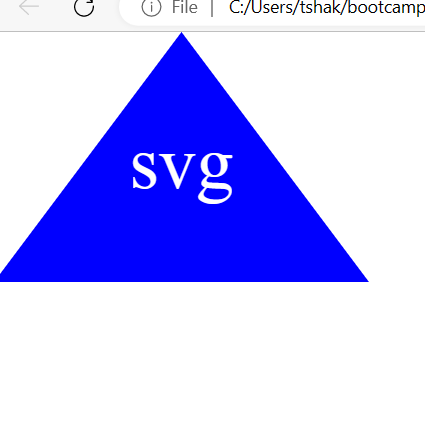

# logo-generator

## Description logo-generator

- To help create a logo for your projects
- to use node to generate an svg file
- It creates a logo that is easy to use
  
## Table of Contents (Optional)

- [logo-generator](#logo-generator)
  - [Description logo-generator](#description-logo-generator)
  - [Table of Contents (Optional)](#table-of-contents-optional)
  - [Installation](#installation)
  - [Usage](#usage)
  - [Credits](#credits)
  - [License- MIT License](#license--mit-license)
  - [Tests- jest](#tests--jest)

## Installation

What are the steps required to install your project?
once the file is open in a code editor- use npm i to ensure the node modules are working properly.
then run node index.js and a prompt will appear in the terminal to guide your requirements.

## Usage

    

https://github.com/tkhupe/ReadMe-Generator

https://drive.google.com/file/d/1HlL9bRAzkyDvJN6DgVRr4YNHMLd8_uqP/view

## Credits

GitHub, Inc.

## License- MIT License

Copyright (c) 2023 Tshakalisa Khupe

Permission is hereby granted, free of charge, to any person obtaining a copy
of this software and associated documentation files (the "Software"), to deal
in the Software without restriction, including without limitation the rights
to use, copy, modify, merge, publish, distribute, sublicense, and/or sell
copies of the Software, and to permit persons to whom the Software is
furnished to do so, subject to the following conditions:

The above copyright notice and this permission notice shall be included in all
copies or substantial portions of the Software.

THE SOFTWARE IS PROVIDED "AS IS", WITHOUT WARRANTY OF ANY KIND, EXPRESS OR
IMPLIED, INCLUDING BUT NOT LIMITED TO THE WARRANTIES OF MERCHANTABILITY,
FITNESS FOR A PARTICULAR PURPOSE AND NONINFRINGEMENT. IN NO EVENT SHALL THE
AUTHORS OR COPYRIGHT HOLDERS BE LIABLE FOR ANY CLAIM, DAMAGES OR OTHER
LIABILITY, WHETHER IN AN ACTION OF CONTRACT, TORT OR OTHERWISE, ARISING FROM,
OUT OF OR IN CONNECTION WITH THE SOFTWARE OR THE USE OR OTHER DEALINGS IN THE
SOFTWARE.

## Tests- jest

a section to run tests has been added and can be accessed by the command - npm run tests in the terminal
